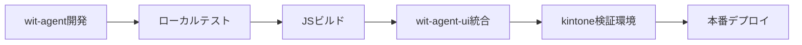

# パターンA/B実装方針書
**担当者**: 小茂田（パターンA/B両方）  
**更新日**: 2025-08-16

## 1. 概要

### 1.1 2パターンのアプローチ

#### パターンA：データ→解析→理由付き結果 直行型
- kintoneから取得可能なデータをそのままAIに与え、総合的な解析を行い、結果＋理由を返却
- **特徴**:
  - 実装がシンプル・迅速
  - エンドツーエンドの学習が可能
  - 各審査項目ごとのスコアリング/可視化は最低限
  - プロンプトエンジニアリングが重要

#### パターンB：審査項目分解→項目別評価→集約判断型
- 事前に定義した審査項目リストに基づき、各項目を個別にAIで評価し、結果を集約して最終判断
- **特徴**:
  - 各審査項目の評価が明確に可視化される
  - ルールベースの判断根拠を追跡可能
  - 新しい審査項目の追加・変更が容易
  - 項目別評価により判断理由の説明が具体的

### 1.2 共通要件
- **フレームワーク**: Mastraを両パターンで使用
- **AI**: OpenAI GPT-4
- **データソース**: Kintone（アプリID: 37）
- **評価基盤**: A/Bテスト用の共通評価パイプライン
- **返却形式**: kintoneへの共通仕様

## 2. システムアーキテクチャ

### 2.1 統合データフロー
```
[kintone(顧客データ/画像)] 
        │（REST API GET /records.json）
        ▼
[データ前処理層]
  - 型正規化 / 欠損補完 / 画像パス確認
        │
        ├─→ パターンA：一括解析Agent (Mastra)
        │            │
        │            └→ 結果+理由（単一オブジェクト）
        │
        └─→ パターンB：項目分割Agent (Mastra)
                     │
                     ├→ 各項目評価結果（複数レコード）
                     └→ 最終判断（集約ロジック）
        │
        ▼（REST API POST /records.json）
[kintone(審査結果 / 理由 / 項目別スコア)]
```

### 2.2 共通コンポーネント
1. **Kintone連携層**: API認証、データ取得/書き戻し
2. **データ前処理モジュール**: 型変換、正規化、バリデーション
3. **Mastraエージェント基盤**: 共通のエージェント実行環境
4. **ログ/監査モジュール**: 両パターンの実行ログ、評価メトリクス

### 2.3 パターン別コンポーネント

#### パターンA専用
- **総合解析エージェント**: 全データを一括処理
- **プロンプトテンプレート**: 総合判断用の詳細プロンプト
- **結果フォーマッター**: シンプルな結果+理由の生成

#### パターンB専用
- **審査項目定義モジュール**: 評価項目のマスタ管理
- **項目別評価エージェント群**: 個別評価の並列実行
- **集約ロジックエンジン**: 重み付け・ルールベースの最終判断
- **項目別結果テーブル**: kintoneサブテーブルへの保存

## 3. 審査項目設計

### 3.1 審査項目カテゴリ（暫定）
| カテゴリ | 審査項目 | 重要度 | データソース |
|---------|---------|--------|-------------|
| 信用情報 | 過去取引履歴 | 高 | kintone取引テーブル |
| | 支払い遅延有無 | 高 | kintone履歴データ |
| | 与信限度額 | 中 | 外部信用情報API |
| 売掛先評価 | 売掛先企業規模 | 中 | kintoneマスタ |
| | 売掛先業種リスク | 中 | 業種別リスクDB |
| | 売掛先支払実績 | 高 | kintone取引履歴 |
| 書類検証 | 請求書整合性 | 高 | 画像OCR解析 |
| | 契約書有効性 | 高 | 画像解析 |
| | 本人確認書類 | 必須 | 画像解析 |
| 財務状況 | 売上高推移 | 中 | kintone財務データ |
| | キャッシュフロー | 高 | 計算値 |
| | 負債比率 | 中 | 計算値 |

### 3.2 審査項目評価仕様
各審査項目は以下の構造で評価されます：
```typescript
interface EvaluationItem {
  itemId: string;           // 項目ID
  itemName: string;         // 項目名
  category: string;         // カテゴリ
  score: number;           // スコア (0-100)
  status: 'pass' | 'fail' | 'warning' | 'pending';
  reason: string;          // 評価理由
  evidence: any[];         // エビデンスデータ
  weight: number;          // 重み係数
  evaluatedAt: Date;       // 評価日時
}
```

## 4. パターンA実装詳細

### 4.1 総合解析アプローチ

#### 4.1.1 基本設計
```typescript
// compliance-agent-pattern-a.ts
class PatternAComplianceAgent {
  private llm: OpenAIProvider;
  private kintoneClient: KintoneClient;
  
  async evaluate(customerId: string): Promise<ComplianceResult> {
    // 1. kintoneから全関連データを取得
    const customerData = await this.fetchAllData(customerId);
    
    // 2. データを構造化してLLMに渡す
    const analysisResult = await this.performComprehensiveAnalysis(customerData);
    
    // 3. 結果をkintoneに保存
    await this.saveResult(analysisResult);
    
    return analysisResult;
  }
  
  private async performComprehensiveAnalysis(data: CustomerData) {
    const prompt = this.buildComprehensivePrompt(data);
    const response = await this.llm.generate(prompt);
    
    return {
      decision: this.parseDecision(response),
      reason: this.parseReason(response),
      riskScore: this.parseRiskScore(response),
      recommendedActions: this.parseActions(response)
    };
  }
}
```

#### 4.1.2 プロンプト設計

##### メインプロンプト構造
```
あなたはファクタリング審査のエキスパートです。
以下の顧客データを総合的に分析し、審査結果を判定してください。

【顧客情報】
- 会社名: {company_name}
- 資本金: {capital}
- 設立年: {established_year}
- 代表者: {representative}

【取引情報】
- 買取債権額: {receivable_amount}
- 買取価格: {purchase_price}
- 担保金額: {collateral_amount}
- 支払予定日: {payment_date}

【過去の取引履歴】
{transaction_history}

【資金使途】
{fund_usage}

【通帳データサマリ】
{bank_statement_summary}

【判定基準】
1. 信用リスクの評価
2. 回収可能性の判断
3. 詐欺リスクの検出
4. 資金使途の整合性

【出力形式】
1. 判定: approve/reject/reviewのいずれか
2. リスクスコア: 0-100の数値
3. 判定理由: 200文字以内の説明
4. 推奨アクション: 箇条書き3つ以内
```

#### 4.1.3 データ取得戦略

```typescript
interface DataFetchingStrategy {
  // 主要データの一括取得
  async fetchAllData(customerId: string): Promise<{
    customerInfo: CustomerInfo;
    transactionData: TransactionData;
    documents: DocumentData[];
    bankStatements: BankStatement[];
    notes: InternalNotes;
  }> {
    // 並列取得で高速化
    const [customer, transactions, docs, bank, notes] = await Promise.all([
      this.fetchCustomerInfo(customerId),
      this.fetchTransactions(customerId),
      this.fetchDocuments(customerId),
      this.fetchBankStatements(customerId),
      this.fetchInternalNotes(customerId)
    ]);
    
    return { customer, transactions, docs, bank, notes };
  }
}
```

### 4.2 パターンA特有の実装要件

#### 4.2.1 強み
- **迅速な実装**: シンプルなアーキテクチャ
- **柔軟な判断**: 明示的なルールに縛られない
- **総合的な視点**: データ間の関係性を自然に考慮

#### 4.2.2 注意点
- **ブラックボックス性**: 判断根拠の追跡が困難
- **プロンプト依存**: プロンプトの品質が結果を左右
- **デバッグの難しさ**: 問題発生時の原因特定が困難

#### 4.2.3 最適化戦略
```typescript
// プロンプトのバージョン管理
class PromptVersionManager {
  versions: Map<string, PromptTemplate>;
  
  // A/Bテスト用の複数バージョン管理
  async getPrompt(version?: string): Promise<PromptTemplate> {
    return this.versions.get(version || 'latest');
  }
  
  // パフォーマンス追跡
  trackPerformance(version: string, result: EvaluationResult) {
    // メトリクス収集
  }
}
```

## 5. パターンB実装詳細

### 5.1 Mastraエージェント構成

#### 5.1.1 メインエージェント
```typescript
// compliance-agent-pattern-b.ts
class PatternBComplianceAgent {
  // 審査項目定義
  private evaluationItems: EvaluationItem[];
  
  // 項目別評価エージェント群
  private itemEvaluators: Map<string, ItemEvaluator>;
  
  // 集約ロジック
  private aggregator: ResultAggregator;
  
  async evaluate(customerData: CustomerData): Promise<ComplianceResult> {
    // 1. データ前処理
    const preprocessedData = await this.preprocess(customerData);
    
    // 2. 項目別評価（並列実行）
    const itemResults = await this.evaluateItems(preprocessedData);
    
    // 3. 結果集約
    const finalResult = await this.aggregate(itemResults);
    
    // 4. kintone書き戻し
    await this.saveToKintone(finalResult);
    
    return finalResult;
  }
}
```

#### 5.1.2 項目別評価エージェント
```typescript
// item-evaluators/credit-check-evaluator.ts
class CreditCheckEvaluator implements ItemEvaluator {
  async evaluate(data: any): Promise<ItemEvaluationResult> {
    // LLMを使用した信用評価
    const prompt = this.buildPrompt(data);
    const llmResponse = await this.llm.generate(prompt);
    
    return {
      score: this.parseScore(llmResponse),
      reason: this.parseReason(llmResponse),
      status: this.determineStatus(llmResponse)
    };
  }
}
```

### 5.2 プロンプトテンプレート設計

#### 5.2.1 基本構造
```
あなたはファクタリング審査の専門家です。
以下の{項目名}について評価してください。

【評価データ】
{data}

【評価基準】
{criteria}

【出力形式】
- スコア: 0-100点
- 判定: pass/fail/warning
- 理由: 具体的な判断根拠を記載
```

#### 5.2.2 項目別カスタマイズ
各審査項目ごとに特化したプロンプトテンプレートを作成：
- 信用情報評価用プロンプト
- 書類検証用プロンプト（画像解析含む）
- 財務分析用プロンプト
- リスク評価用プロンプト

### 5.3 集約ロジック実装

#### 5.3.1 重み付けスコアリング
```typescript
class WeightedScoringAggregator {
  aggregate(itemResults: ItemEvaluationResult[]): FinalScore {
    let totalScore = 0;
    let totalWeight = 0;
    
    for (const item of itemResults) {
      totalScore += item.score * item.weight;
      totalWeight += item.weight;
    }
    
    return totalScore / totalWeight;
  }
}
```

#### 5.3.2 ルールベース判定
```typescript
class RuleBasedAggregator {
  rules = [
    { condition: '必須項目にfailが存在', result: 'reject' },
    { condition: 'スコア平均が70未満', result: 'review' },
    { condition: 'warningが3項目以上', result: 'review' },
    { condition: '全項目pass', result: 'approve' }
  ];
  
  evaluate(itemResults: ItemEvaluationResult[]): Decision {
    // ルールを順次評価
    for (const rule of this.rules) {
      if (this.checkCondition(rule, itemResults)) {
        return rule.result;
      }
    }
  }
}
```

## 6. kintone連携仕様

### 6.1 データ取得
```typescript
interface KintoneDataFetcher {
  // 顧客基本情報取得
  getCustomerData(customerId: string): Promise<CustomerData>;
  
  // 取引履歴取得
  getTransactionHistory(customerId: string): Promise<Transaction[]>;
  
  // 画像ファイル取得
  getDocumentImages(customerId: string): Promise<DocumentImage[]>;
}
```

### 6.2 結果書き戻し

#### 6.2.1 メインレコード更新
```typescript
interface ComplianceResult {
  result: 'approve' | 'reject' | 'review';
  finalScore: number;
  reason: string;
  evaluatedAt: Date;
}
```

#### 6.2.2 項目別評価テーブル保存
```typescript
interface ItemEvaluationRecord {
  customerId: string;
  evaluationId: string;
  itemName: string;
  category: string;
  score: number;
  status: string;
  reason: string;
  evaluatedAt: Date;
}
```

### 6.3 エラーハンドリング
- API接続エラー時の再試行ロジック
- データ不整合時の警告通知
- 画像取得失敗時の代替処理

## 7. 実装スケジュール

### Phase 1: 共通基盤構築（Week 1-2）
- [ ] Mastra環境セットアップ
- [ ] kintone API接続確立
- [ ] 共通データモデル定義
- [ ] データ前処理層実装
- [ ] ログ/監査基盤構築

### Phase 2: パターンA実装（Week 2-3）
- [ ] 総合解析エージェント実装
- [ ] 総合判断プロンプト設計
- [ ] 結果フォーマッター実装
- [ ] 単体テスト

### Phase 3: パターンB実装（Week 3-4）
- [ ] 審査項目マスタ設計
- [ ] 項目別評価エージェント実装
  - [ ] 信用情報評価
  - [ ] 売掛先評価
  - [ ] 書類検証
  - [ ] 財務評価
- [ ] 集約ロジック実装
- [ ] 項目別結果テーブル実装

### Phase 4: 統合・比較評価（Week 5-6）
- [ ] 両パターンのエンドツーエンドテスト
- [ ] A/Bテスト環境構築
- [ ] 精度比較評価
- [ ] パフォーマンス測定
- [ ] kintone書き戻しテスト

### Phase 5: 最適化・本番準備（Week 6-7）
- [ ] 評価結果に基づく改善
- [ ] ハイブリッド戦略検討
- [ ] 本番環境準備
- [ ] ドキュメント整備
- [ ] 運用マニュアル作成

## 8. テスト計画

### 8.1 単体テスト
- 各評価エージェントの入出力検証
- プロンプト生成ロジックテスト
- スコアリング計算テスト
- ルール判定ロジックテスト

### 8.2 統合テスト
- データフロー全体の検証
- 並列処理の動作確認
- kintone連携の正常性確認
- エラー時のフォールバック確認

### 8.3 精度評価
- 既存案件データでの検証
- 人間の判断との一致率測定
- 項目別評価の妥当性検証
- 最終判断の適切性評価

## 9. 運用考慮事項

### 9.1 監視項目
- 処理時間（目標: 30秒以内/件）
- API応答時間
- エラー発生率
- 各項目の評価分布

### 9.2 メンテナンス
- 審査項目の追加・変更手順
- プロンプトテンプレートの更新
- 重み係数の調整
- ルールの追加・修正

### 9.3 改善サイクル
- 月次での精度レビュー
- 四半期での項目見直し
- フィードバックループの確立
- A/Bテスト結果の反映

## 10. リスクと対策

| リスク | 影響度 | 対策 |
|--------|--------|------|
| LLM応答の不安定性 | 高 | 複数回試行、フォールバック |
| 処理時間の長期化 | 中 | 並列処理、キャッシュ活用 |
| 項目間の依存関係 | 中 | 依存グラフ管理、順序制御 |
| データ不整合 | 高 | バリデーション強化、警告通知 |
| コスト超過 | 中 | トークン使用量監視、最適化 |

## 11. 成功指標（KPI）

### 11.1 技術指標
- 処理成功率: 99%以上
- 平均処理時間: 30秒以内
- システム稼働率: 99.5%以上

### 11.2 ビジネス指標
- 審査精度: 90%以上（人間判断との一致率）
- 誤認可率: 1%未満
- 審査時間短縮: 80%削減

### 11.3 運用指標
- 項目追加の容易性: 1日以内で実装可能
- トラブル対応時間: 1時間以内
- ドキュメント充実度: 全機能カバー

## 12. 次のアクション

### 即座に着手すべきタスク
1. **審査項目の詳細定義**
   - 先方へのヒアリング実施
   - 項目優先度の確定
   - 評価基準の明文化

2. **開発環境準備**
   - Mastraプロジェクト初期化
   - kintoneテスト環境接続
   - サンプルデータ準備

3. **プロトタイプ作成**
   - 最重要3項目での評価実装
   - 簡易的な集約ロジック
   - 動作確認とフィードバック収集

### 確認事項
- [ ] kintoneアプリIDとフィールド定義
- [ ] 画像データのアップロード仕様
- [ ] 既存審査プロセスの詳細フロー
- [ ] セキュリティ要件の確認
- [ ] 本番環境へのアクセス権限

## 13. 開発・デプロイメントアーキテクチャ

### 13.1 リポジトリ構成と役割分担

#### 13.1.1 リポジトリ分離戦略
```
wit-agent/ (本リポジトリ)
├── エージェント開発・ロジック実装
├── kintone API連携（読み取り専用）
├── テスト環境での検証
└── JS化ビルドパイプライン

wit-agent-ui/ (UIリポジトリ - 別途作成)
├── kintone上でのUI表示
├── データ可視化ダッシュボード
├── 審査結果表示インターフェース
└── kintoneカスタマイズJS

kintone本番環境
├── 読み取り専用API経由でデータ取得
├── UI JavaScriptアプリとして実装
└── 書き込みは段階的に実装
```

#### 13.1.2 開発フロー


### 13.2 安全な開発・テスト戦略

#### 13.2.1 データ保護方針
```typescript
// kintone-api-wrapper.ts
class KintoneAPIWrapper {
  private readonly readOnlyMode: boolean = true;
  
  async fetchData(appId: string, query: string) {
    // 読み取り専用実装
    return await this.kintoneClient.get({
      app: appId,
      query: query
    });
  }
  
  async writeData(appId: string, records: any[]) {
    if (this.readOnlyMode) {
      // テスト時はログ出力のみ
      console.log('[DRY-RUN] Would write:', records);
      return { success: true, dryRun: true };
    }
    // 本番時のみ実行
    return await this.kintoneClient.post({ app: appId, records });
  }
}
```

#### 13.2.2 環境分離
| 環境 | 用途 | kintoneアクセス | データ書き込み |
|------|------|----------------|----------------|
| ローカル開発 | 機能開発・単体テスト | モックデータ | なし |
| テスト環境 | 統合テスト | 読み取り専用 | ログ出力のみ |
| ステージング | UAT | 読み取り専用 | ドライラン |
| 本番 | 実運用 | フルアクセス | 有効 |

### 13.3 JavaScriptビルド・デプロイ戦略

#### 13.3.1 ビルドパイプライン
```javascript
// webpack.config.js
module.exports = {
  entry: './src/mastra/agents/index.ts',
  output: {
    filename: 'wit-agent-bundle.js',
    path: path.resolve(__dirname, 'dist'),
    library: 'WitAgent',
    libraryTarget: 'umd'
  },
  target: 'web',
  module: {
    rules: [
      {
        test: /\.tsx?$/,
        use: 'ts-loader',
        exclude: /node_modules/
      }
    ]
  },
  externals: {
    // kintone.jsで提供されるAPIは外部依存として扱う
    'kintone': 'kintone'
  }
};
```

#### 13.3.2 kintone JavaScript カスタマイズ実装
```javascript
// kintone-app-customization.js
(function() {
  'use strict';
  
  // レコード詳細画面表示時
  kintone.events.on('app.record.detail.show', function(event) {
    // WitAgentライブラリを読み込み
    const agent = new WitAgent.PatternBComplianceAgent({
      readOnly: true,  // 初期は読み取り専用
      apiEndpoint: 'https://api.wit-agent.example.com'
    });
    
    // 審査実行ボタンを追加
    const button = createEvaluationButton();
    kintone.app.record.getHeaderMenuSpaceElement().appendChild(button);
    
    button.onclick = async function() {
      // 現在のレコードデータを取得
      const record = event.record;
      
      // エージェント実行（読み取り専用）
      const result = await agent.evaluate(record);
      
      // 結果を画面に表示（書き込みはしない）
      displayEvaluationResult(result);
    };
    
    return event;
  });
})();
```

### 13.4 段階的実装計画

#### 13.4.1 Phase 1: 読み取り専用実装（Week 1-2）
- [ ] kintone API認証設定（読み取り権限のみ）
- [ ] データ取得モジュール実装
- [ ] ローカルでのエージェント動作確認
- [ ] テストデータでの評価実行

#### 13.4.2 Phase 2: UIプロトタイプ（Week 3-4）
- [ ] wit-agent-uiリポジトリ作成
- [ ] 基本UIコンポーネント開発
- [ ] 評価結果表示画面実装
- [ ] kintoneカスタマイズビュー統合

#### 13.4.3 Phase 3: JavaScriptビルド（Week 5）
- [ ] TypeScript → JavaScript変換設定
- [ ] webpackビルド設定
- [ ] kintone互換性テスト
- [ ] バンドルサイズ最適化

#### 13.4.4 Phase 4: 検証環境テスト（Week 6）
- [ ] kintone検証アプリ作成
- [ ] JavaScriptアップロード
- [ ] 実データでの動作確認
- [ ] パフォーマンス測定

#### 13.4.5 Phase 5: 本番移行準備（Week 7）
- [ ] 書き込み機能の段階的有効化
- [ ] エラーハンドリング強化
- [ ] ロールバック手順確立
- [ ] 運用マニュアル作成

### 13.5 セキュリティ考慮事項

#### 13.5.1 APIキー管理
```javascript
// 環境変数による管理（ローカル開発）
const API_KEY = process.env.KINTONE_API_KEY;

// kintone上では暗号化フィールドを使用
const getApiKey = async () => {
  const config = await kintone.plugin.app.getConfig();
  return decrypt(config.encryptedApiKey);
};
```

#### 13.5.2 データアクセス制限
- 最小権限の原則に従ったAPI権限設定
- 読み取り専用トークンの使用
- IPアドレス制限の設定
- 監査ログの有効化

### 13.6 テスト戦略

#### 13.6.1 モックデータ準備
```typescript
// test-data/mock-kintone-data.ts
export const mockCustomerData = {
  recordId: 'TEST-001',
  customerId: { value: 'CUST-12345' },
  customerName: { value: 'テスト株式会社' },
  transactionAmount: { value: 1000000 },
  // ... 他のフィールド
};
```

#### 13.6.2 E2Eテストシナリオ
1. kintoneからデータ取得（読み取りのみ）
2. エージェント評価実行
3. 結果の画面表示確認
4. ドライラン書き込みログ確認
5. エラーケースのハンドリング確認

### 13.7 モニタリング・ログ設計

#### 13.7.1 ログ出力設計
```typescript
interface AuditLog {
  timestamp: Date;
  action: 'fetch' | 'evaluate' | 'dryrun_write';
  userId: string;
  recordId: string;
  result: any;
  environment: 'local' | 'test' | 'staging' | 'production';
}
```

#### 13.7.2 メトリクス収集
- API呼び出し回数
- 評価処理時間
- エラー発生率
- ドライラン実行回数

## 14. 参考資料

### 技術ドキュメント
- [Mastra公式ドキュメント](https://mastra.ai/docs)
- [kintone REST API リファレンス](https://developer.cybozu.io/hc/ja/articles/360000313406)
- [kintone JavaScript カスタマイズ](https://developer.cybozu.io/hc/ja/articles/201941754)
- [OpenAI API ドキュメント](https://platform.openai.com/docs)

### 関連ファイル
- `/src/mastra/agents/compliance-agent.ts` - 既存エージェント実装
- `/src/mastra/tools/` - 既存ツール群
- `/src/api/compliance-api.ts` - API実装
- `/webpack.config.js` - ビルド設定（作成予定）
- `/dist/wit-agent-bundle.js` - ビルド済みJS（生成物）

### リポジトリ
- 本リポジトリ: `wit-agent` - エージェント開発
- UIリポジトリ: `wit-agent-ui` - kintone UI実装（作成予定）

---

**本ドキュメントは随時更新されます。最新版は常に本ファイルを参照してください。**

最終更新: 2025-08-16  
作成者: 小茂田  
レビュー: 未実施

## 15. 役割分担・責任範囲

### 15.1 担当者変更
| 項目 | 当初 | 現在 |
|------|------|------|
| パターンA開発 | 上野 | 小茂田 |
| パターンB開発 | 小茂田 | 小茂田 |
| kintone連携共通部品 | 上野 | 小茂田 |
| 評価基盤 | 両名 | 小茂田 |

### 15.2 現在の責任範囲（小茂田）
1. **パターンA/B両方の実装**
   - 両エージェントの設計・開発
   - プロンプトエンジニアリング
   - テスト・デバッグ

2. **共通基盤の構築**
   - kintone API連携モジュール
   - データ前処理層
   - ログ/監査基盤

3. **評価・比較**
   - A/Bテスト環境構築
   - 精度比較分析
   - 最適パターンの提案

4. **ドキュメント作成**
   - 実装方針書
   - API仕様書
   - 運用マニュアル

### 15.3 コミュニケーションプラン
- PMへの進捗報告: 週次
- ステークホルダーへのデモ: フェーズ毎
- 技術的課題のエスカレーション: 即時