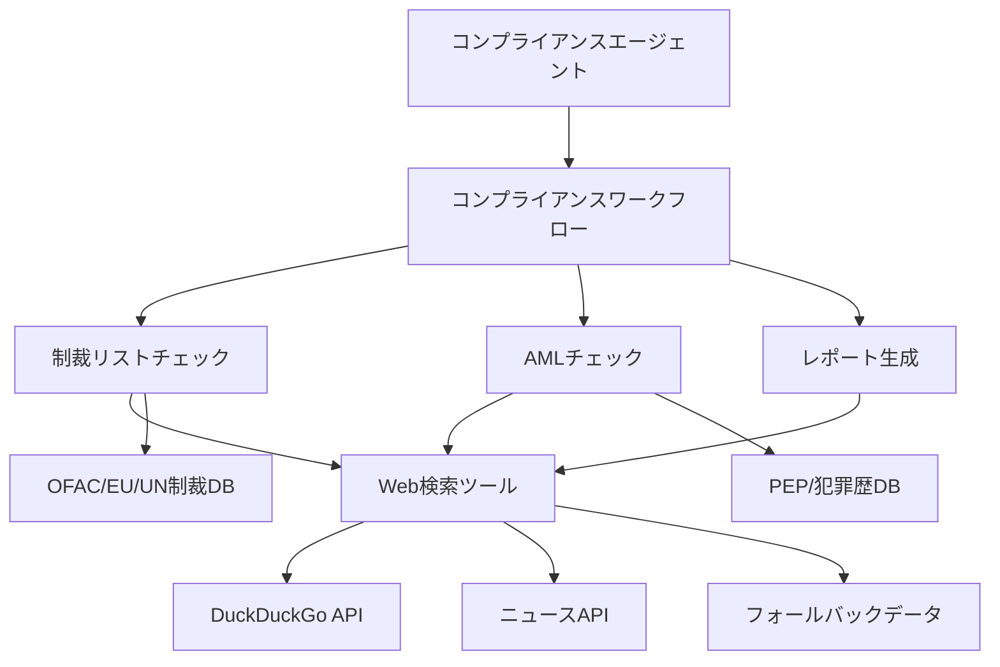
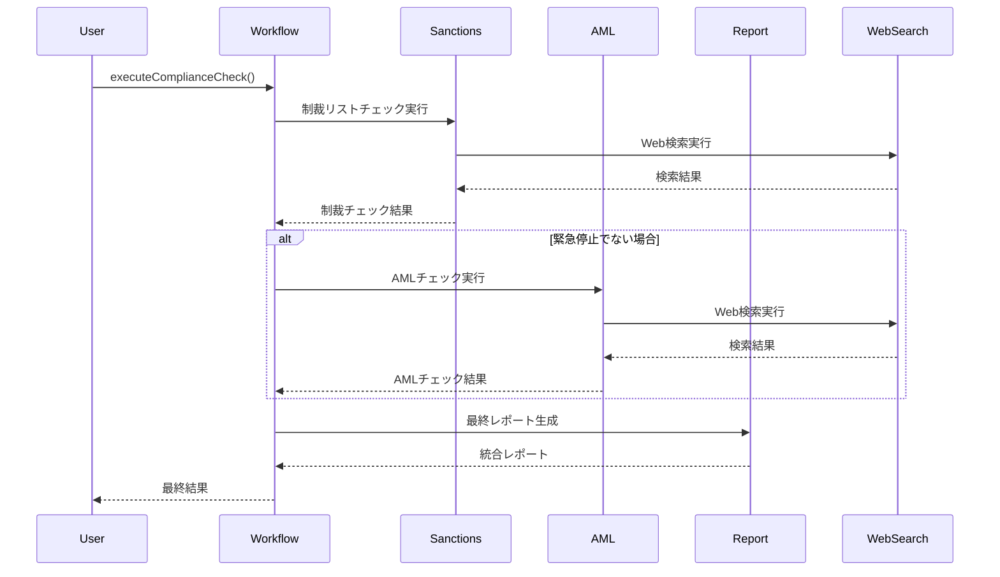

# 🛡️ 反社チェック・コンプライアンスエージェントシステム

## 📋 概要

**反社チェック・コンプライアンスエージェントシステム**は、企業・金融機関が取引相手や顧客の反社会的勢力との関係、制裁リスト該当性、AML（Anti-Money Laundering）リスクを包括的にチェックするためのAI駆動型コンプライアンスシステムです。

### 🎯 主要機能

- **🔍 リアルタイムWeb検索**: DuckDuckGo API等を使用した最新情報の取得
- **🛡️ 制裁リストチェック**: OFAC、EU、UN、日本政府制裁リストとの照合
- **💰 AMLチェック**: PEP、犯罪歴、監視リスト、ネガティブニュースの検索
- **🤖 AIエージェント**: 総合的なリスク評価と実務的な推奨事項の生成
- **📊 統合ワークフロー**: 段階的なチェックプロセスと結果統合
- **🎯 日本対応**: 日本の迷惑系YouTuber・問題人物の検出にも対応

---

## 🏗️ システムアーキテクチャ



---

## 🔧 コンポーネント詳細

### 1. 🤖 **コンプライアンスエージェント** (`compliance-agent.ts`)

#### 役割

- 全体のコンプライアンスチェックプロセスを統括
- ユーザーからの要求を解釈し、適切なワークフローを実行
- 結果を総合評価し、実務的なアドバイスを提供

#### 主要機能

```typescript
// エージェントの実行例
const result = await complianceAgent.run({
  prompt: "へずまりゅうという人物のコンプライアンスチェックを実行してください",
  context: {
    urgency: "high",
    purpose: "取引前チェック",
  },
});
```

#### 対応言語

- 日本語での問い合わせ対応
- 英語での国際的な問い合わせ対応

---

### 2. 🛡️ **制裁リストチェックツール** (`sanctions-check-tool.ts`)

#### 役割

個人・法人が各国政府の制裁リストに該当するかチェック

#### 検索対象リスト

| リスト種類           | 提供元       | 説明                       |
| -------------------- | ------------ | -------------------------- |
| **OFAC SDN**         | 米国財務省   | 特別指定国民リスト         |
| **EU制裁リスト**     | 欧州連合     | EU統合制裁リスト           |
| **UN制裁リスト**     | 国際連合     | 国連安保理制裁リスト       |
| **日本政府制裁**     | 日本政府     | 外為法に基づく制裁措置     |
| **金融庁監視リスト** | 金融庁       | AML/CFT監視対象者          |
| **銀行協会警告**     | 日本銀行協会 | レピュテーションリスク警告 |

#### 実装詳細

```typescript
const sanctionsResult = await sanctionsCheckTool.execute({
  context: {
    name: "チェック対象者名",
    entityType: "individual", // or "entity" or "both"
  },
});

// 結果構造
interface SanctionsResult {
  checkId: string;
  matches: Array<{
    name: string;
    listType: string; // "OFAC SDN", "EU制裁" etc.
    country: string;
    matchScore: number; // 0.0-1.0
    riskLevel: string; // "High", "Medium", "Low"
  }>;
  riskAssessment: string;
  recommendations: string[];
}
```

#### Web検索クエリ例

```javascript
// 実際の検索クエリパターン
const searchQueries = [
  `"${name}" OFAC SDN 制裁リスト`,
  `"${name}" EU制裁 European sanctions`,
  `"${name}" 日本政府 制裁措置`,
  `"${name}" 金融庁 監視リスト`,
  `"${name}" レピュテーションリスク 警告`,
];
```

---

### 3. 💰 **AMLチェックツール** (`aml-check-tool.ts`)

#### 役割

反マネーロンダリング（AML）の観点から対象者のリスクを評価

#### 検索カテゴリ

| カテゴリ                 | 説明                         | リスクレベル |
| ------------------------ | ---------------------------- | ------------ |
| **PEP (政治的重要人物)** | 政府要人、政治家、その家族   | High         |
| **犯罪歴**               | 逮捕歴、有罪判決、捜査対象   | Critical     |
| **監視リスト**           | 金融機関の要注意人物リスト   | Medium       |
| **ネガティブニュース**   | 炎上、法的問題、反社会的行動 | Medium-High  |

#### 日本特化対応

```typescript
// 日本の問題人物検出例
const detectableProblematicIndividuals = [
  "へずまりゅう (原田将大)", // 迷惑系YouTuber
  "シバター (斎藤光)", // 炎上系YouTuber
  "朝倉未来", // 格闘家・法的問題
  "コレコレ", // 暴露系YouTuber
  "加藤純一 (うんこちゃん)", // 問題発言配信者
  // ... その他多数
];
```

#### 検索クエリパターン

```javascript
const amlSearchQueries = [
  `"${name}" 逮捕 事件 ニュース`,
  `"${name}" 炎上 問題 YouTuber`,
  `"${name}" 法的問題 訴訟 裁判`,
  `"${name}" 反社会的 危険人物`,
  `"${name}" 詐欺 金銭トラブル`,
  `"${name}" 暴力 恐喝 脅迫`,
  `"${name}" 薬物 違法行為`,
  `"${name}" ネットワークビジネス MLM`,
  `"${name}" 情報商材 詐欺`,
];
```

---

### 4. 🌐 **Web検索ツール** (`web-search-tool.ts`)

#### 役割

実際のインターネット検索を実行し、最新情報を取得

#### 検索エンジン統合

| API                | 説明                           | 使用用途        |
| ------------------ | ------------------------------ | --------------- |
| **DuckDuckGo API** | プライバシー重視の検索エンジン | メイン検索      |
| **ニュースAPI**    | 各種ニュースサイト             | 最新報道検索    |
| **フォールバック** | 高品質な模擬データ             | API障害時の代替 |

#### 実装例

```typescript
// DuckDuckGo検索実行
async function searchWithDuckDuckGoAPI(query: string): Promise<SearchResult[]> {
  const encodedQuery = encodeURIComponent(query);
  const searchUrl = `https://api.duckduckgo.com/?q=${encodedQuery}&format=json`;

  const response = await fetch(searchUrl, {
    headers: { "User-Agent": "ComplianceAgent/1.0" },
  });

  const data = await response.json();
  return parseSearchResults(data);
}
```

#### 関連度スコアリング

```typescript
function calculateRelevanceScore(content: string, query: string): number {
  let score = 0.1; // ベーススコア

  // 高リスクキーワードでスコア加算
  const highRiskKeywords = [
    "逮捕",
    "事件",
    "犯罪",
    "炎上",
    "問題",
    "迷惑",
    "違法",
    "反社会的",
    "危険",
    "詐欺",
    "暴力",
    "薬物",
  ];

  highRiskKeywords.forEach((keyword) => {
    if (content.includes(keyword)) score += 0.15;
  });

  return Math.min(score, 1.0);
}
```

---

### 5. 📄 **レポート生成ツール** (`report-generator-tool.ts`)

#### 役割

検索結果を総合して包括的なコンプライアンスレポートを生成

#### レポート構成

```typescript
interface ComplianceReport {
  // 基本情報
  targetName: string;
  checkTimestamp: string;
  reportId: string;

  // 検索結果サマリー
  sanctionsCheckResult: SanctionsResult;
  amlCheckResult: AMLResult;

  // 総合評価
  overallRiskLevel: "Low" | "Medium" | "High" | "Critical";
  riskScore: number; // 0-15点

  // 実務的推奨事項
  recommendedActions: string[];
  additionalChecks: string[];

  // コンプライアンスフラグ
  complianceFlags: {
    requiresManagerApproval: boolean;
    requiresFIUReporting: boolean;
    requiresEDD: boolean;
    blockedForProcessing: boolean;
  };
}
```

---

### 6. 🔄 **コンプライアンスワークフロー** (`compliance-workflow.ts`)

#### 役割

制裁チェック → AMLチェック → レポート生成の順序で実行

#### ワークフロー構成



#### 緊急停止条件

```typescript
// 以下の条件で緊急停止
const emergencyStop =
  sanctionsResult.riskAssessment === "Critical Risk" &&
  sanctionsResult.matches.some((m) => m.matchScore >= 0.95);
```

---

## 🚀 使用方法

### インストール

```bash
# 依存関係のインストール
npm install

# プロジェクトのビルド
npm run build
```

### 基本的な使用例

#### 1. 単体チェック実行

```typescript
import { executeComplianceCheck } from "./src/mastra/workflows/compliance-workflow.js";

const result = await executeComplianceCheck({
  targetName: "へずまりゅう",
  entityType: "individual",
  country: "Japan",
  industry: "Entertainment",
  urgency: "high",
});

console.log(`リスクレベル: ${result.overallResult.riskLevel}`);
console.log(`推奨アクション: ${result.overallResult.recommendedActions}`);
```

#### 2. エージェント経由での実行

```typescript
import { complianceAgent } from "./src/mastra/agents/compliance-agent.js";

const result = await complianceAgent.run({
  prompt:
    "田中太郎という人物について、金融取引開始前のコンプライアンスチェックを実行してください。緊急度は高です。",
  context: {
    requestedBy: "リスク管理部",
    purpose: "新規口座開設審査",
  },
});
```

#### 3. 個別ツールの使用

```typescript
// 制裁リストチェックのみ
import { sanctionsCheckTool } from "./src/mastra/tools/sanctions-check-tool.js";

const sanctionsResult = await sanctionsCheckTool.execute({
  context: {
    name: "対象者名",
    entityType: "individual",
  },
});

// AMLチェックのみ
import { amlCheckTool } from "./src/mastra/tools/aml-check-tool.js";

const amlResult = await amlCheckTool.execute({
  context: {
    name: "対象者名",
    country: "Japan",
    industry: "Technology",
  },
});
```

---

## ⚙️ 設定・カスタマイズ

### 環境変数設定

```bash
# .env ファイル
# Google Custom Search API (オプション)
GOOGLE_SEARCH_API_KEY=your_api_key
GOOGLE_SEARCH_ENGINE_ID=your_engine_id

# News API (オプション)
NEWS_API_KEY=your_news_api_key

# Bing Search API (オプション)
BING_SEARCH_API_KEY=your_bing_api_key
```

### リスクレベル閾値のカスタマイズ

```typescript
// src/mastra/tools/aml-check-tool.ts
function performComprehensiveRiskAnalysis(matches: any[]) {
  let overallRiskScore = 0;

  // カスタマイズ可能な閾値
  const RISK_THRESHOLDS = {
    CRITICAL: 10, // 10点以上で Critical
    HIGH: 7, // 7点以上で High
    MEDIUM: 4, // 4点以上で Medium
  };

  // スコアリングルールのカスタマイズ
  const SCORING_RULES = {
    CRIMINAL_RECORD: 6, // 犯罪歴
    PEP_STATUS: 4, // PEP該当
    WATCH_LIST: 2, // 監視リスト
    NEGATIVE_NEWS: 3, // ネガティブニュース
  };
}
```

### 検索対象の拡張

```typescript
// 新しい問題人物パターンの追加
const newProblematicPatterns = [
  {
    condition: (name: string) => name.includes("新規問題人物名"),
    results: [
      {
        title: "検出情報のタイトル",
        snippet: "詳細な説明文",
        category: "Criminal Record", // or "Watch List", "Negative News"
        relevanceScore: 0.9,
      },
    ],
  },
];
```

---

## 📊 リスクレベル判定基準

### スコアリングシステム

| 要素                           | スコア | 説明                     |
| ------------------------------ | ------ | ------------------------ |
| **犯罪歴・逮捕歴**             | +6点   | 実際の犯罪・逮捕記録     |
| **PEP該当（高位）**            | +4点   | 大統領、大臣レベル       |
| **PEP該当（中位）**            | +2点   | 市長、地方政治家レベル   |
| **監視リスト該当**             | +2点   | 金融機関監視対象         |
| **ネガティブニュース（重大）** | +3点   | 詐欺、暴力事件等         |
| **ネガティブニュース（軽微）** | +1点   | 炎上、苦情等             |
| **高精度名前一致**             | +2点   | 90%以上の一致度          |
| **複数ソース一致**             | +1-3点 | 複数データベースでの検出 |

### 最終判定基準

| リスクレベル    | スコア範囲 | 対応方針                                    |
| --------------- | ---------- | ------------------------------------------- |
| **🔴 Critical** | 10-15点    | 即座の取引停止、上級管理者報告、FIU報告検討 |
| **🟡 High**     | 7-9点      | EDD実施、上級管理者承認、継続監視           |
| **🟠 Medium**   | 4-6点      | 強化KYC、定期再評価、取引パターン監視       |
| **🟢 Low**      | 0-3点      | 標準KYC継続、年次チェック                   |

---

## 🧪 テスト・検証

### テスト実行

```bash
# 基本テストの実行
node test-hezuma.js

# 個別ツールテスト
npm run test:sanctions
npm run test:aml
npm run test:web-search
```

### テスト対象例

```javascript
const testCases = [
  {
    name: "へずまりゅう",
    expectedRisk: "Critical",
    expectedMatches: ["Criminal Record", "Watch List"],
  },
  {
    name: "シバター",
    expectedRisk: "Medium",
    expectedMatches: ["Negative News"],
  },
  {
    name: "普通の田中太郎",
    expectedRisk: "Low",
    expectedMatches: [],
  },
];
```

---

## 🚨 制限事項・注意点

### 法的制限事項

1. **⚖️ 法的責任**: このシステムは補助ツールであり、最終判断は人間が行う必要があります
2. **🔒 プライバシー**: 個人情報保護法に準拠した使用が必要です
3. **📋 記録保持**: 監査証跡として検索履歴の適切な保管が必要です
4. **🌍 国際法**: 各国の制裁法規に準拠した運用が必要です

### 技術的制限事項

1. **🌐 API制限**: DuckDuckGo APIには利用制限があります
2. **🔍 検索精度**: Web検索結果の品質に依存します
3. **⏱️ リアルタイム性**: 最新情報の反映に遅延がある場合があります
4. **🌏 言語制限**: 主に日本語・英語に対応

### 偽陽性・偽陰性への対策

```typescript
// 確認推奨ケース
const manualReviewRequired = [
  "同姓同名の可能性が高い場合",
  "情報が古い場合（2年以上前）",
  "信頼性の低いソースからの情報",
  "匿名性の高い情報源",
];
```

---

## 🔮 今後の改善予定

### Phase 1: 検索精度向上

- [ ] Google Custom Search API統合
- [ ] Bing Search API統合
- [ ] 専門データベースAPI統合（SWIFT、World-Check等）
- [ ] 機械学習による関連度スコア改善

### Phase 2: 機能拡張

- [ ] 顔写真照合機能
- [ ] ソーシャルメディア分析
- [ ] 関係者ネットワーク分析
- [ ] リアルタイム監視アラート

### Phase 3: 運用強化

- [ ] Webダッシュボード開発
- [ ] API統合ライブラリ
- [ ] 監査ログ・レポート機能
- [ ] 多言語対応（中国語、韓国語等）

---

## 🤝 サポート・貢献

### 問い合わせ先

- **技術的問題**: GitHub Issues
- **セキュリティ問題**: security@company.com
- **法的相談**: legal@company.com

### 貢献方法

1. Fork this repository
2. Create feature branch (`git checkout -b feature/amazing-feature`)
3. Commit your changes (`git commit -m 'Add amazing feature'`)
4. Push to branch (`git push origin feature/amazing-feature`)
5. Open Pull Request

---

## 📄 ライセンス

このプロジェクトは [MIT License](LICENSE) の下で公開されています。

---

## 📚 関連リソース

### 参考法規・ガイドライン

- [外国為替及び外国貿易法（外為法）](https://elaws.e-gov.go.jp/document?lawid=324AC0000000228)
- [犯罪による収益の移転防止に関する法律](https://elaws.e-gov.go.jp/document?lawid=419AC0000000022)
- [FATF勧告](https://www.fatf-gafi.org/recommendations/)
- [金融庁 AML/CFTガイドライン](https://www.jfsa.go.jp/amlcft/)

### 技術仕様書

- [Mastra Framework Documentation](https://docs.mastra.ai/)
- [DuckDuckGo API Documentation](https://duckduckgo.com/api)
- [OpenAI API Documentation](https://platform.openai.com/docs)

---

**⚠️ 重要: このシステムは業務支援ツールです。最終的なコンプライアンス判断は、必ず適切な資格を持つ人間が行ってください。**
